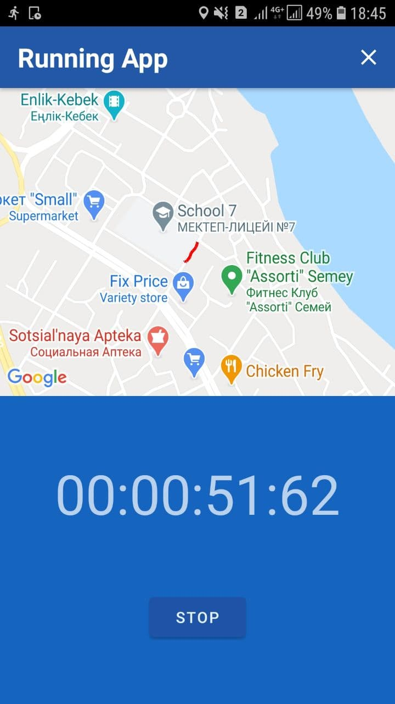
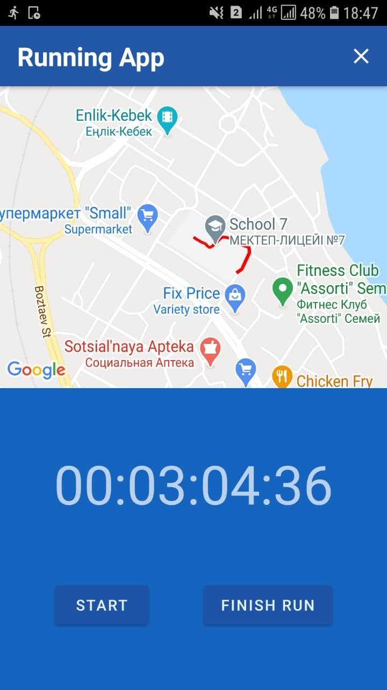
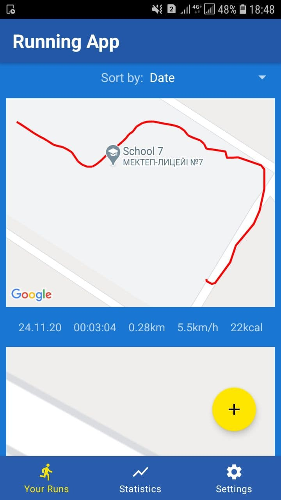
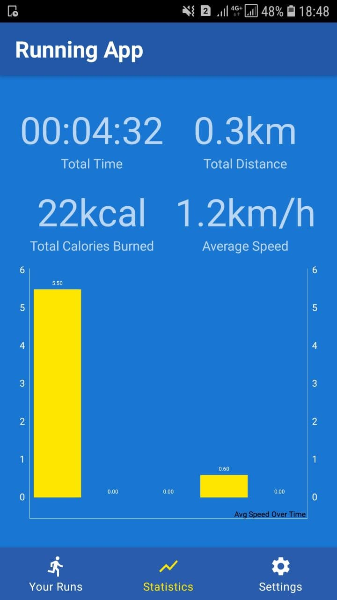
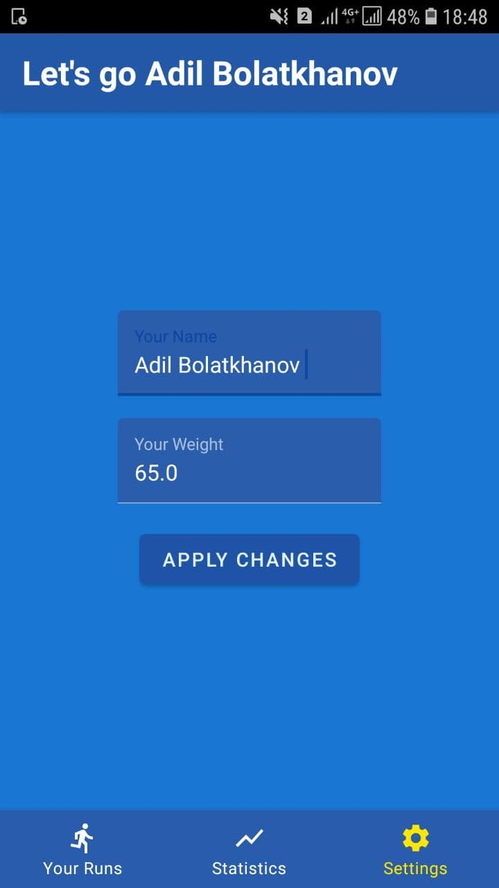

# RunningTrackerApp
An app that tracks your running on Google Map that works as a foreground service. User can
track their progress by viewing all runs and overall statistics: calories burned, distance, time, speed

## Applied concepts
* Kotlin
* MVVM
* DI: Dagger-Hilt
* Google Map
* Navigation Component
* Room
* Coroutines

## Screenshots
 
  
  
