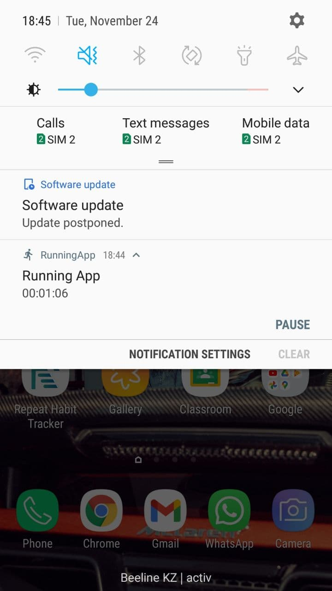

# RunningTrackerApp
An app that tracks your running on Google Map that works as a foreground service. User can
track their progress by viewing all runs and overall statistics: calories burned, distance, time, speed

## Tech Stack
* 100% Kotlin
* Modern Architecture: Model-View-ViewModel, Clean Architecture
* Reactive UIs using [LiveData][3] observables and [Data Binding][4].
* [Dagger-Hilt][6] as dependency injection
* [Google Map API][7] to show map, current location, and the path that the user passed.
* A single-activity architecture, using the [Navigation Component][8] to manage fragment operations, and deal with whole in-app navigation
* [Room][5] local database to store all runs
* [Kotlin Coroutines][9] for managing background threads with simplified code and reducing needs for callbacks
* A presentation layer that contains a fragment (View) and a [ViewModel][2](store and manage UI-related data in a lifecycle conscious way) per screen (or feature) .

The architecture is built around [Android Architecture Components][0].

We followed the recommendations laid out in the [Guide to App Architecture][1] when deciding on the architecture for the app. We kept logic away from Activities and Fragments and moved it to [ViewModels][2]. We observed data using [LiveData][3] and used the [Data Binding Library][4] to bind UI components in layouts to the app's data sources.

We used a Repository layer for handling data operations. [Room][5] - local data source of all runs

## Screenshots
 
  
  

[0]: https://developer.android.com/topic/libraries/architecture
[1]: https://developer.android.com/jetpack/guide
[2]: https://developer.android.com/topic/libraries/architecture/viewmodel
[3]: https://developer.android.com/topic/libraries/architecture/livedata
[4]: https://developer.android.com/topic/libraries/data-binding
[5]: https://developer.android.com/training/data-storage/room
[6]: https://dagger.dev/hilt/
[7]: https://developers.google.com/maps/documentation
[8]: https://developer.android.com/guide/navigation
[9]: https://kotlinlang.org/docs/reference/coroutines-overview.html
